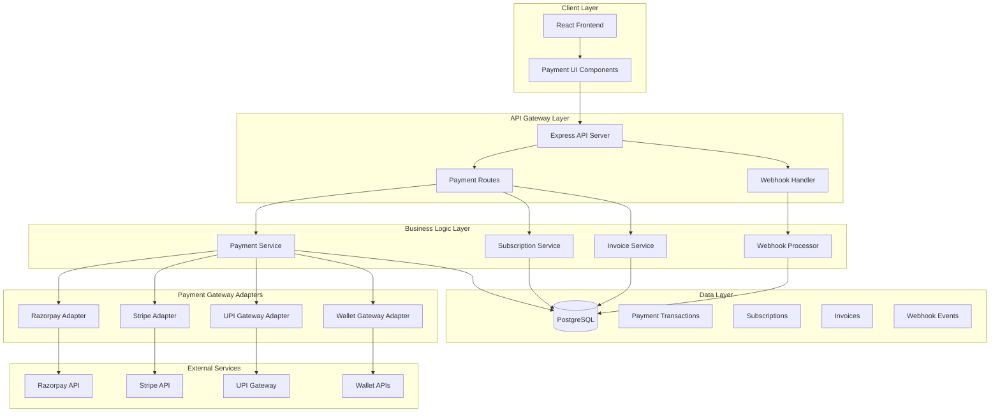
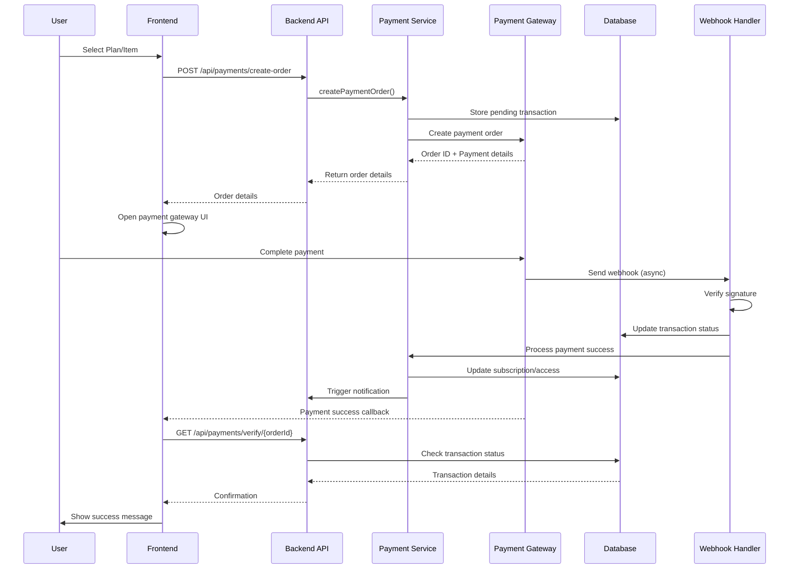
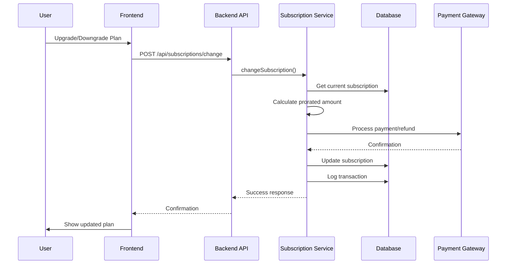

# Design Document: Payment Integration

## Overview

This design implements a comprehensive payment processing system for Examerit, an exam preparation platform. The system supports multiple payment gateways (Razorpay, Stripe, UPI, and wallet payments), subscription management for tiered plans (Free, Basic, Premium, Elite), one-time payments for mentorship sessions and premium tests, payment history tracking, invoice generation, and webhook handling for asynchronous payment status updates. The architecture follows a modular approach with clear separation between payment gateway adapters, business logic, and data persistence layers, ensuring scalability, security, and maintainability. The implementation prioritizes PCI DSS compliance, idempotent operations, secure webhook verification, and comprehensive audit logging for all payment transactions.

## Architecture

### System Architecture

### Payment Flow Sequence Diagram

### Subscription Management Flow

## Components and Interfaces

### Component 1: Payment Gateway Adapter (Abstract)